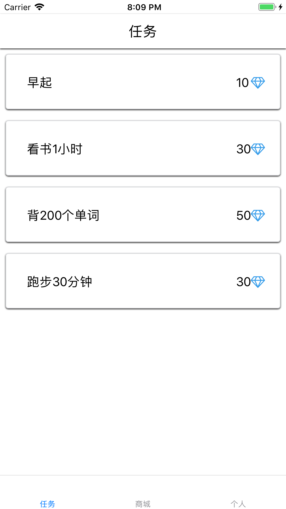
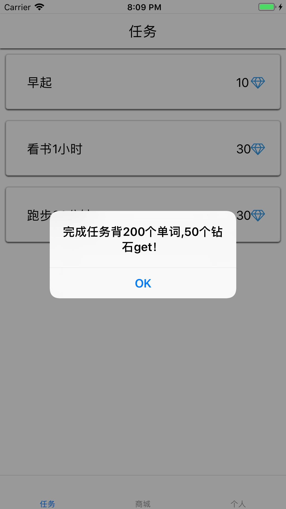
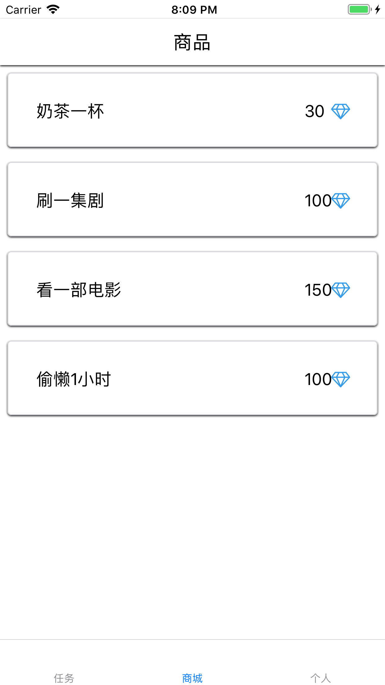
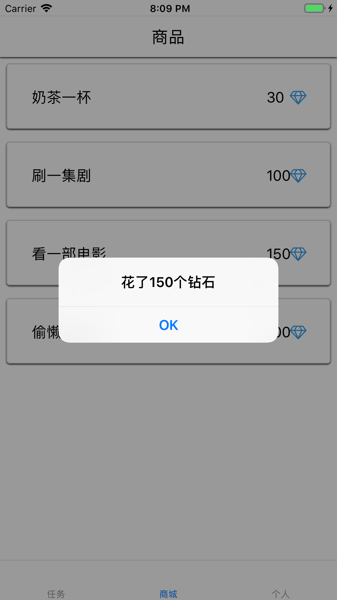
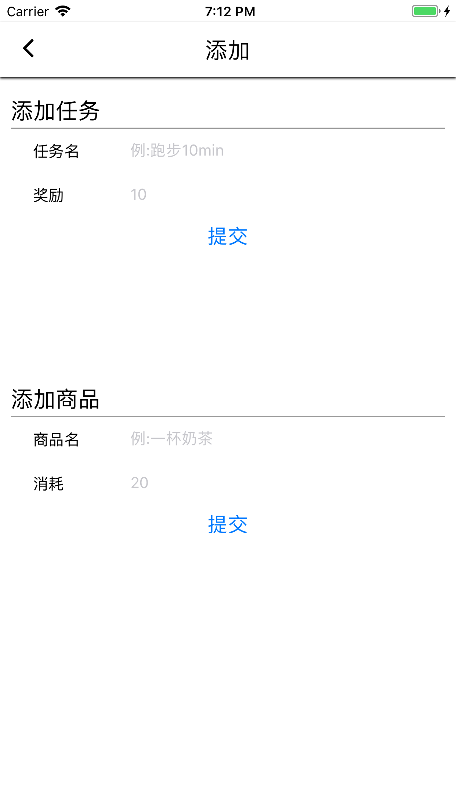
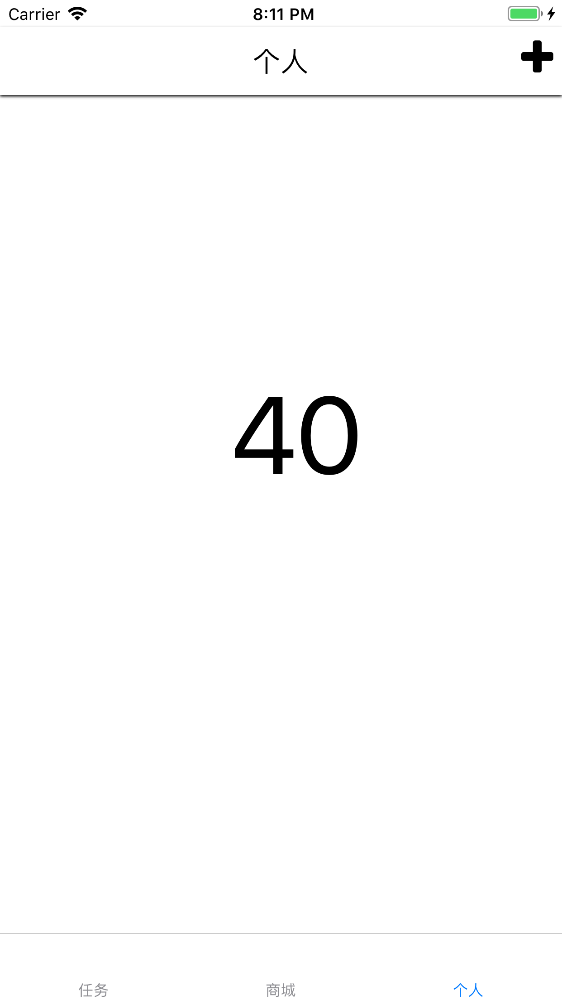

### 技术
React-native技术栈
### 功能描述
主要基于游戏的思想实现了一个GTD工具，用户给自己增加任务，完成的话可以有一个虚拟的钻石奖励。用这些虚拟奖励可以为自己“购买”一些对自己“不利”的“商品”，帮助用户实现自我管理。
### 界面截图
#### 任务界面

#### 商品界面

#### 添加及个人界面

### 待完成功能
- [ ] 给任务扩展多个属性，比如循环功能，定时功能，限制次数功能
- [ ] 给商品扩展多个属性，比如限制购买次数
- [ ] 增加可视化记录

### 总结
项目规划没有做好，突然来了deadline，做得比较匆忙，在上手的过程中消耗了大量的时间。所以以后如果时间紧迫的话，尽量不要尝试新技术，一些无法预料的问题会占用很长时间，应该用原生写的。