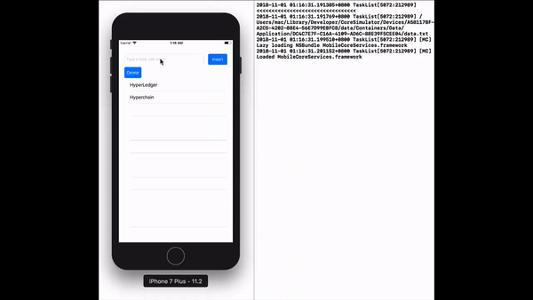
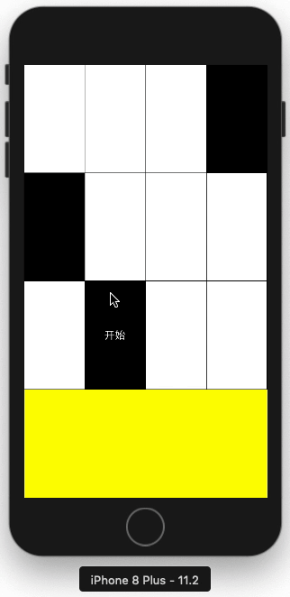

# Marveliu’s homework

- [Calendar: simple cal command implement](#calendar)
- [TaskList: gui implement](#TaskList)
- [DontTouchWhiteBlock: a game for Iphone workshop](#DontTouchWhiteBlock)

## Calendar

基于Object-C实现一个简单的Calendar。

### Usage:

```shell
使用:
  命令:
    cal
    cal -m [month]
    cal [month] [year]
    cal [year]
  检查:
    年: 正数
    月: 1-12之间的正数
```

### Make

```shell
cd Calendar
make
./cal [option]
```

### Example

[](https://asciinema.org/a/ZlmQTMcrUSM06hnpv8zyYMc5M)

## TaskList

简单的任务列表，支持添加和删除，以及数据持久化。

### Example



## DontTouchWhiteBlock

本项目基于Objective-C实现iPhone端的《别踩白块》游戏，并设置“经典”与“街机”两种游戏模式，同时设置分数记录器来记录和更新玩家的最高分数。



### Modules
- 界面控制模块：根据玩家在iPhone端的交互信息，实现游戏界面的设计与切换。
- 游戏控制模块：控制游戏中黑、白块的生成以及在不同模式下的移动速度。
- 逻辑控制模块：实现游戏中的逻辑，踩到白块游戏结束，踩到黑块分数增加。
- 分数控制模块：对玩家的游戏得分进行记录与展示，并实时更新最高得分。

### Contributors
- 21851164 刘尚楠: https://github.com/Marveliu
- 21851109 陈振宇: https://github.com/zhenyuczy
